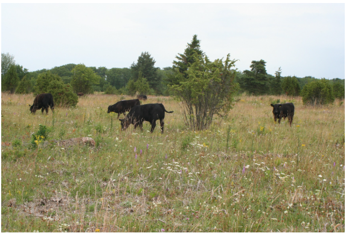
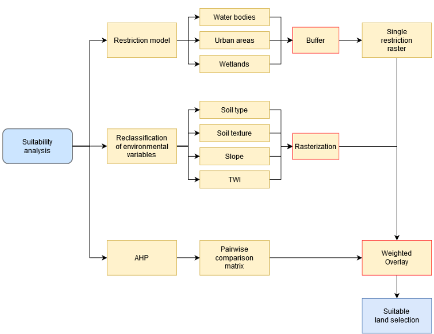
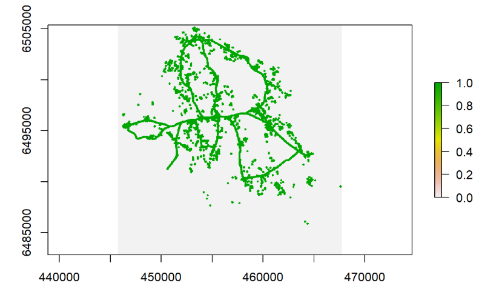
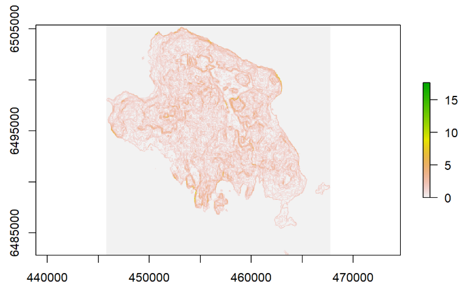
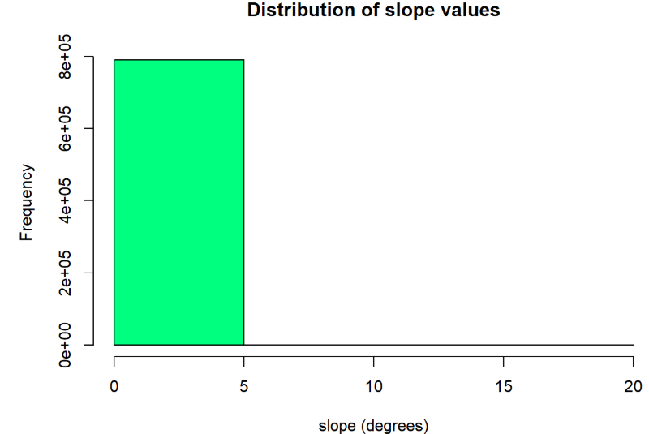
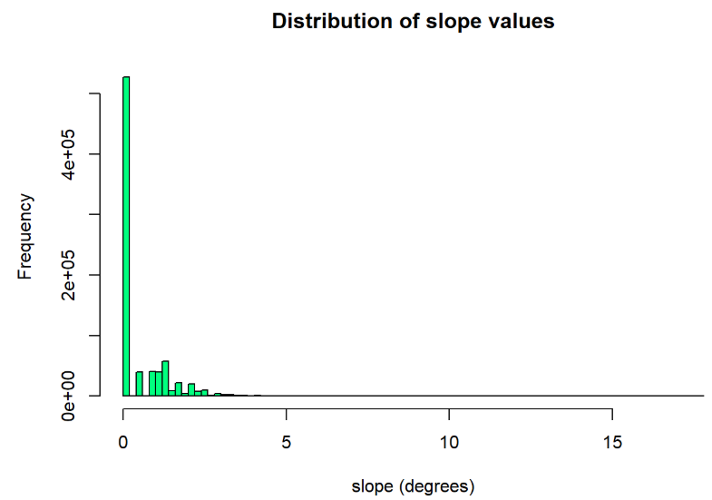
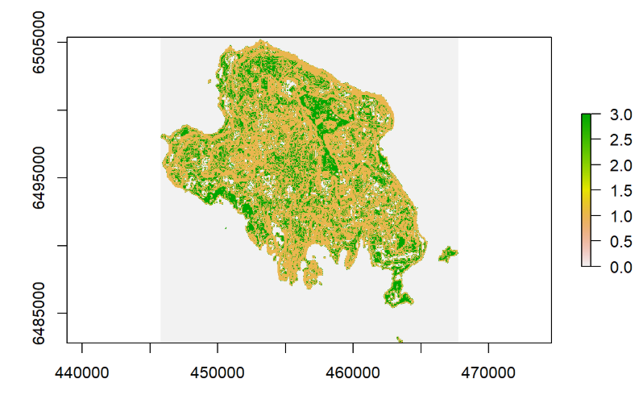
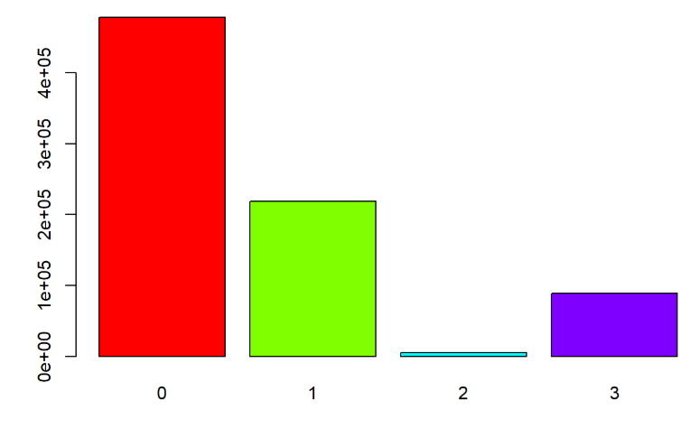
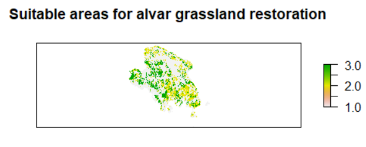

Suitability modelling of Alvar grasslands in Muhu, Estonia
================
Irada Ismayilova

*In this tutorial you will learn to perform one of the most common
spatial analysis technique: Suitability analysis. However, instead of
the typical GIS software approach, you will make use of different vector
and raster data manipulation packages in R.*

<figure>

<figcaption aria-hidden="true">Alvar grassland in Estonia. <em>Source:
europarc.org</em></figcaption>
</figure>

# Data

For this task you are given the following data sets:

- Estonian soil database
- DEM
- Topographic Wetness Index (TWI)
- Three different land use vector files

You can download the mentioned data from here:
<https://mediastore.rz.uni-augsburg.de/get/ceRAa2qne5/>

# Getting started

As with any R project, we will start by importing required libraries. If
you haven’t installed any of these packages, please do so before calling
the library.

``` r
#to install packages that you haven't installed before, use the install.packages() function then call the relevant libraries

#install.packages("sp")

library("sp")
```

    ## Warning: Paket 'sp' wurde unter R Version 4.4.2 erstellt

``` r
library("raster")
```

    ## Warning: Paket 'raster' wurde unter R Version 4.4.2 erstellt

``` r
library("sf")
```

    ## Warning: Paket 'sf' wurde unter R Version 4.4.2 erstellt

    ## Linking to GEOS 3.13.0, GDAL 3.10.1, PROJ 9.5.1; sf_use_s2() is TRUE

In order to avoid long folder paths, we can set the working directory.
Do not forget to insert the correct path.

``` r
setwd("")
```

Now we can start loading the given vector and raster data in. For
loading raster data we will use **raster** package. For loading vector
data we will use two different packages, **sp** and **sf**. Sf package
allows us to import vector data in a tabular form just like we would
have it in e.g. QGIS. Yet sp package is easier to use in many analysis.

Sp package utilizes **Shapefile** function to read in the data, while sf
package uses **st_read**. Raster package uses simple **raster** function
to load in the data.

You can always check what parameters you need to pass into a certain
function by inserting a question mark before a function
e.g. **?st_read**.

``` r
#modify the lines below to import all the data

Urban.area <- shapefile("urban.shp")

#Water.body <- shapefile()

#Wetland <- shapefile()
  
Soil.database <- st_read("soil_database.shp")

DEM <- raster("dem.tif")

#TWI <- raster()
```

Once the data loaded in and you can see all the variables in the
*Environment* pane, you can check how vector and arster data are stored.
You can either call the variable name or plot it.

```
Soil.database

Urban.area
```

``` r
plot(DEM, main = "Digital elevation model of the \n Muhu island, Estonia")
```

**What do axes and the legend of the plot show?**

# Analysis

In order to find suitable areas for restoration of Alvar grasslands we
will follow the steps shown on the flowchart below.

<figure>

<figcaption aria-hidden="true"><em>Workflow of the AHP incorporated
suitability analysis</em></figcaption>
</figure>

## Restriction model

Restriction model shows the areas that are not allowed to consider in
the suitability modelling. These are the areas too close to e.g. water
bodies or settlements. Alvar suitable areas should be located 100m away
from urban areas and water bodies, and 150m away from wetlands.

To achieve it, we will use buffer method of the raster package with the
given distance values.

``` r
#check the buffer method to see what other arguments can be passed in, to modify the results
#?buffer

#modify the lines below to create buffers

urban.buffer <- buffer(Urban.area, width=100, dissolve=TRUE)

#wetland.buffer <- buffer() 

#water.buffer <- buffer()
```

**Weighted overlay** can be performed with raster layers. Therefore
throughout the tutorial we will convert all final vector layers to
rasters. This also applies to the buffers we just created.

Unlike to any GIS software, we first have to create an empty raster with
an extent and pixel size. Then we will use this empty raster to
rasterize all vector layers.

``` r
# create empty raster with the raster function

empty.raster <- raster() #run it to check what parameters are assigned by default

empty.raster
```

Lets reshape it using the parameters of the DEM layer, so that it
perfectly covers the Muhu island. To get the parameters of the DEM layer
just run the DEM variable.

``` r
DEM
```

``` r
#utilize the parameters above to reshape the raster

empty.raster <- raster(ncol=880, nrow=902, 
                       xmn=445750, xmx=467750, 
                       ymn=6482825, ymx=6505375)
```

To set the CRS of the raster we will again use the one from the DEM.

``` r
crs(DEM)

projection(empty.raster) <- " +proj=lcc +lat_0=57.5175539305556 +lon_0=24 +lat_1=59.3333333333333 +lat_2=58 +x_0=500000 +y_0=6375000
+ellps=GRS80 +units=m +no_defs"

compareCRS(DEM, empty.raster)
```

**Is there a need to change the resolution of the empty raster to the
one as DEM?**

**Vector -\> Raster conversion**

For the conversion we will utilize Rasterize method of the raster
package.

``` r
#check the rasterize method to see what other arguments can be passed in, to modify the results

#modify the lines below to rasterize all buffers

urban.raster <- rasterize(urban.buffer, empty.raster, background= 0)

#water.raster <- rasterize()

#wetland.raster <- rasterize()
```

**If you would like to create an alpha band (non visible background)
which value should you pass into background?**

``` r
#lets plot one of the rasters to see if it looks okay

plot(urban.raster)
```



We can now join all three rasters so that we have a single raster layer
that represent restricted cells. The join we can express with the
logical operator **OR**.

``` r
#you can check for the symbol of each logical operator online

restriction <- water.raster  | urban.raster  | wetland.raster

plot(restriction)
```

**Why did not we sum or multiply rasters to put them together?**

## Reclassification of the soil database

The soil database contains various columns, yet we are interested only
in soil type (upd_siffer) and soil texture (LXTYPE1). Some soil types
and textures are more suitable to alvars than the others. Therefore, we
will select the types and textures and assign them values from 3 to 1,
where 3 is the most suitable and 1 is not suitable.

*Soil types*:

- **3**: *“K”, “Kr”, “Krg”;*
- **2**: *” Gh1”, “Gh2”, “Kg”, “Khg”;*
- **1**: *everything else*

*Soil texture*:

- **3**: *“SL”, “LS”;*
- **2**: *“L”, “S”;*
- **1**: *everything else*

We imported soil database as an sf object so we can treat it as a data
frame (or attribute table) and use operators and ifelse statement to
select and assign values. Since we select string we can use %in%
operator (and not OR).

``` r
#we can add a new column to the dataframe with the $ sign

#modify the lines below to reclassify soil database

Soil.database$Type <- ifelse(Soil.database$upd_siffer %in% c( "K", "Kr", "Krg"), 3,
                             ifelse(Soil.database$upd_siffer %in% c( " Gh1", "Gh2", "Kg", "Khg"), 2, 1))


#Soil.database$Texture <- ifelse()
```

Now the soil database have two additional columns populated with values
from 3 to 1. We can use these columns to create soil type and soil
texture rasters.

Check the rasterize method to find out which argument you should use to
create a new raster based on the field in the vector data.

``` r
#modify the lines below to rasterize soil type and texture

#Soil.type <- rasterize()

#Soil.texture <- rasterize()

#plot(Soil.type)
```

**Slope and TWI**

The last environmental variable that we have to reclassify and convert
into rasters are slope and TWI. TWI is already provided, yet the slope
we should calculate from the DEM.

We can utilize terrain method to calculate slope in degrees. Check the
method to see other argument options.

``` r
Slope <- terrain(DEM, opt="slope", unit="degrees")

plot(Slope)
```



We can now reclassify the slope raster into 3 suitability groups just
like before. Reclassification of a raster is the process where we create
a new raster with new values based on the old raster. Therefore, we
should first figure out what is the value range of the raster. We can
retreive this information with the summary function as well as by
plotting the raster.

``` r
summary(Slope)
```

``` r
# Increase or decrease the breaks to have a better representation of the data

hist(Slope,
     breaks= 3,
     main = "Distribution of slope values",
     xlab = "slope (degrees)", ylab = "Frequency",
     col = "springgreen")
```



``` r
hist(Slope,
     breaks= 100,
     main = "Distribution of slope values",
     xlab = "slope (degrees)", ylab = "Frequency",
     col = "springgreen")
```



**What does each bin in the histogram represents?**

Now that we know the minimum or maximum cell values we can reclassify
this raster. Unlike a GIS software, we have to first provide a
reclassification matrix. This matrix shows to which new values old
values will be converted.

*Slope*:

- **3**: *0 - 0.7;*
- **2**: *0.7 - 0.9;*
- **1**: *0.9 - Inf*

``` r
# First two values in the matrix show the range of old values, while the third value indicates the new raster value

reclass.matrix <- c(0, 0.7, 3,
                0.7, 0.9, 2,
                0.9, Inf, 1)

#we have to reshape it so that it has columns and rows

reclass.matrix.reshape <- matrix(reclass.matrix,
                    ncol = 3,
                    byrow = TRUE)

# check how the matrix looks like

reclass.matrix.reshape
```

To reclassify a raster using a reclassification matrix we can use
reclassify method.

``` r
slope.reclassified <- reclassify(Slope, reclass.matrix.reshape)

#plot to see if it worked out and if there are any odd numbers

plot(slope.reclassified)
```



``` r
barplot(slope.reclassified)
```



It might happen that your reclassified raster contains 4 values instead
of 3. You can replace 0 values with 1

``` r
slope.reclassified[slope.reclassified == 0] <- 1
```

Similar procedure must be applied to the TWI raster. Note that TWI might
contain negative values.

*TWI*:

- **3**: *5 - 10;*
- **2**: *10 - Inf;*
- **1**: *0 - 5*

``` r
# #modify the lines below to reclassify twi

#reclass.matrix2 <- c()

#reclass.matrix2.reshape <- matrix()

#twi.reclassified <- reclassify()

#plot(twi.reclassified)
#barplot(twi.reclassified)

#Replace values that are 0 with 1 if needed
```

## Weighted overlay

Using the AHP you calculated weights for each environmental parameter.
By multiplying each raster by its weight and summing all of them up will
give you the suitable cells.

``` r
weighted.overlay <- 0.595* Soil.type + 0.265* Soil.texture + 0.070* slope.reclassified + 0.070* twi.reclassified

plot(weighted.overlay)
```

Note that this multiplication produces a raster that contains also
floating values between 1-3. You can change it by reclassifying the
raster as follows:

- **3**: *2.3 - 3;*
- **2**: *1.6 - 2.3;*
- **1**: *0 - 1.6*

``` r
# reclassify weighted overlay raster using the previous learned techniques
```

## Final suitable area selection

We have found areas that fall into each suitability level (1-3).
However, it does not take into account restricted areas. Therefore, we
can multiply the results of the weighted overlay with the restriction
raster and find suitable areas outside the restricted cells.

Note that our restriction raster contains values 0 and 1. We have to
invert them first and then multiply the rasters.

``` r
restriction.invert <- (restriction-1) * (-1)

#suitable areas not colliding with the restricted areas. Do not forget to use the reclassified raster. Example below does not use the reclassified raster

suitable.areas <- restriction.invert*weighted.overlay
```

Now you can plot the suitable areas for alvar grasslands and save the
results.

``` r
#example plot

plot(suitable.areas, 
     main="Suitable areas for alvar grassland restoration", 
     axes=FALSE)

writeRaster(suitable.areas, "suitable_areas.tif")
```


